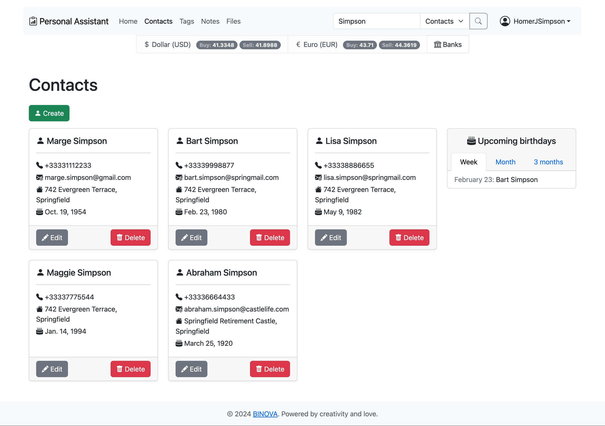
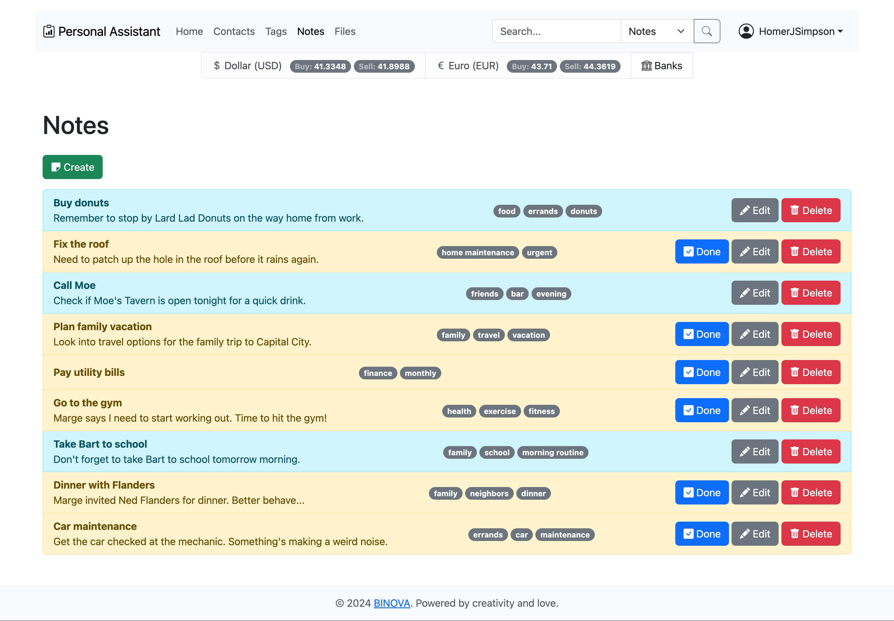

```
  ____                                 _      _            _     _              _
 |  _ \ ___ _ __ ___  ___  _ __   __ _| |    / \   ___ ___(_)___| |_ __ _ _ __ | |_
 | |_) / _ \ '__/ __|/ _ \| '_ \ / _` | |   / _ \ / __/ __| / __| __/ _` | '_ \| __|
 |  __/  __/ |  \__ \ (_) | | | | (_| | |  / ___ \\__ \__ \ \__ \ || (_| | | | | |_
 |_|   \___|_|  |___/\___/|_| |_|\__,_|_| /_/   \_\___/___/_|___/\__\__,_|_| |_|\__|
```

# Personal Assistant

This web application offers a comprehensive suite of features for managing
contacts, notes, and files, all integrated with a powerful tagging system for
enhanced organization and search capabilities. It also provides up-to-date news
and currency exchange rates, ensuring users have access to real-time
information. With robust user authentication and personalized data access, the
application ensures a secure and customized experience, while utilizing cloud
storage and caching for optimal performance.


## Features

- **Contacts:** Allows users to manage their contact list with CRUD operations,
  including organizing by birthdays and searching by name.

- **Tags:** Enables users to create and delete tags, with restrictions on
  deletion if the tag is in use, and shared across all users.

- **Notes:** Provides a simple note-taking feature with title and description,
  enhanced by tag-based categorization and advanced search functionality.

- **Files:** Allows file uploads and viewing, securely storing content in the
  cloud and enabling filtering and sorting via a tag-like system.

- **News:** Displays global news and currency exchange rates, with real-time
  data and a caching system for faster load times, including a
  superuser-controlled data sync.

- **Users:** Manages user authentication, including registration, login, and
  password recovery, ensuring personalized access to data and features while
  protecting against spam accounts.


## Screenshots

<table>
  <tbody>
    <tr>
      <td></td>
      <td></td>
    </tr>
  </tbody>
</table>

See more [here](https://bin0va.github.io/Personal-Assistant/).


## Installation

**Note:** The Docker command is optional since the project can work with
`SQLite` when environment variables for `PostgreSQL` are not defined.

```bash
$ git clone https://github.com/BIN0VA/Personal-Assistant.git
$ cd Personal-Assistant
$ docker compose up -d
$ poetry shell
$ poetry install
$ cd personal_assistant
$ python manage.py migrate
$ python manage.py createsuperuser
```


## Usage

```bash
$ docker compose up -d
$ poetry shell
$ cd personal_assistant
$ python manage.py runserver
```

Go to http://localhost:8000.
